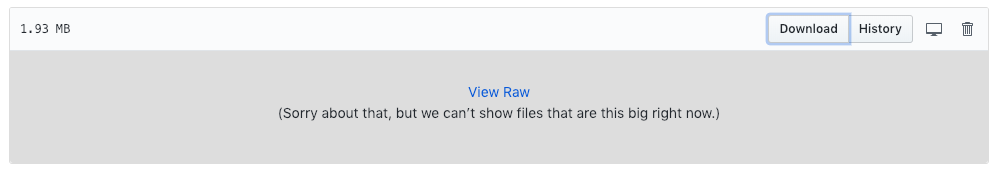

In this folder, you will find visualizations of potential heteroplasmic sites in chloroplast (plastid) and mitochondrial genomes of Daucus carota, based on 34 publicly available samples.

These browser-based interactive visualizations are created by icHET. They let users explore potential heteroplasmic sites across all samples. Each site is color coded based on its major allele: red (A), blue (C), green (G), purple (T), and orange (deletion); a heteroplasmic insertion is shown when the site is hovered over. Color intensity represents the variant's major allele frequency.

- First, download the .html files to your computer. Then, open them on your browser such as Safari, Chrome, or Firefox, to explore heteroplasmic sites in Daucus carota’s chloroplast and mitochondrial genomes
- To download the .html files, click on them and then right click on the *Download* button, then select *Save link as...* to download the file to your computer.

