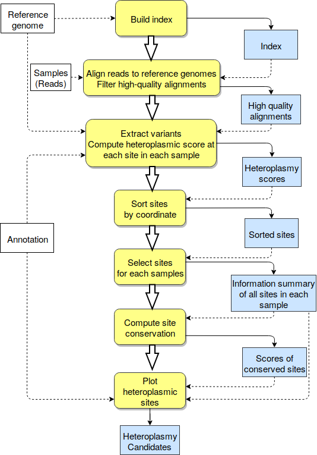

# icHET: Exploratory Visualization of Cytoplasmic Heteroplasmy

## Heteroplasmy Visualization

Presently, visualization of heteroplasmies is available for [*Daucus carota*](https://github.com/vtphan/HeteroplasmyWorkflow/tree/master/Daucus_carota).

## Heteroplasmy Workflow

icHet is a workflow for visualizing and detecting heteroplasmies across multiple genomic samples. It is designed to take advantage of high-performance clusters.

<p align="center">

</p>

#### REQUIREMENTS:
1. Python 3 packages:
	- Biopython
	- Bokeh
	- Flexx

2. Other tools:
	- Bwa (http://bio-bwa.sourceforge.net/)
	- SAMtools (http://samtools.sourceforge.net/)

#### INSTALL REQUIRED PACKAGES VIA ANACONDA:

You can use Anaconda distribution for easier installation.

1. Install Anaconda:

	- Download the appropriate .sh file from https://www.anaconda.com/download/
	- In the directory with the .sh file, run the .sh file using the following commands:
		- Make executable if needed:  ```chmod 755 SampleFileName.sh```
		- Run installer script: ```./SAMPLEFILENAME.sh```

2. Install required packages:
	
	- On Linux/Max: run ```sh install_packages.sh```
	- On Windows: run these commands
	```
	conda install -y -c anaconda biopython
	conda install -y -c bokeh bokeh
	conda install -y -c conda-forge flexx
	conda config --add channels defaults
	conda config --add channels conda-forge
	conda config --add channels bioconda
	conda install -y bwa
	conda install -y samtools
	conda install -y bzip2
	```
		

**Note**

After installing SAMtools via anaconda, you may have this error:

```
samtools: error while loading shared libraries: libcrypto.so.1.0.0: cannot open shared object file: No such file or directory
```

Here is the suggested easiest way to fix this error: 

	- Go to *anaconda3 library* directory: (assume that your anaconda is installed in $HOME/anaconda)
	```cd $HOME/anaconda3/lib``` 
	- Make a copy of *libcrypto.so.1.1.1* and rename it to "libcrypto.so.1.0.0"
	
There are many other ways to fix this error, for example ([SAMtools dependency in wrong version](https://github.com/bioconda/bioconda-recipes/issues/12100)), please try them to fix the error.


#### CONFIGURATION: 
You need to specify paths to your data in a configuration file. See config.txt for example.

##### config.txt:

1. Required inputs:

- READS_DIR: path to reads directory containing FASTQ/FQ file(s). Reads must be paired-end reads and each pair must have suffix (\_1.fastq and \_2.fastq) or (\_1.fq or \_2.fq).
- REF: path to reference genomes. This is the concatenated of all genomes (nuclear DNA, mitochondrial genome, chloroplast genome).
- LOG_FILE: path to log file.
- OUTPUT_DIR: path to output directory.
- cp_ref : path to chloroplast genome.
- cp_annotation : path to chloroplast annotation file.
- mt_ref: path to mitochondria genome.
- mt_annotation: path to mitochondri annotation file.
- mitochondria: mitochondria sequence IDs. This can be a list, separated by commas.
- chloroplast: chloroplast sequence IDs. This can be a list, separated by commas.

It is not neccessary to use single or double quote for these paths. The workflow will generate the OUTPUT_DIR if it doesn't exists.

If there are no input sequence IDs for mitochondria or chloroplast, the program terminates. 

See [example_config.txt](https://github.com/vtphan/HeteroplasmyWorkflow/blob/master/examples/example_config.txt) for example of config file.


2. Optional inputs:
- DIST: name of distance function used to compute conservation scores of heteroplasmic sites (hellinger or consine). Default = hellinger distance.
- alignment_quality: quality threshold for SAMtools to filter alignments. Default = 20.
- score_threshold: threshold for conservation scores of heteroplasmic sites to be shown in visualization. Default = 10.
- percentage_threshold: threshold for base percentage of heteroplasmic sites to be shown in visualization. Default = 0.05


##### Readids.txt:
Text file contains all input reads ID you want to run. Each line is reserved for only one ID. The output plots the samples by the ordering of read names in this file.

Reads should be paired-end reads, and only the SampleID needs to be specified in the readids.txt file. For example, if you have sample SRR2146923 with a pair of reads named SRR2146923_1.fastq and SRR2146923_2.fastq, you only have to specify SRR2146923 in the readids.txt file.

See [example_read_ids.txt](https://github.com/vtphan/HeteroplasmyWorkflow/blob/master/examples/example_read_ids.txt) for example of read IDs file.

#### HOW TO RUN:

```python run_hpc.py config.txt readids.txt```

- config.txt: configuration file
- readids.txt: read IDs file.

#### VISUALIZATION:

The program will output both visualization for mitochondria and chloroplast if users gives paths to chloroplast and mitochondrial genomes, annotation files, as well as sequence IDs.

Outputs for mitochondria and chloroplast will be separated into OUTPUT_DIR/mitochondria and OUTPUT_DIR/chloroplast directories.


